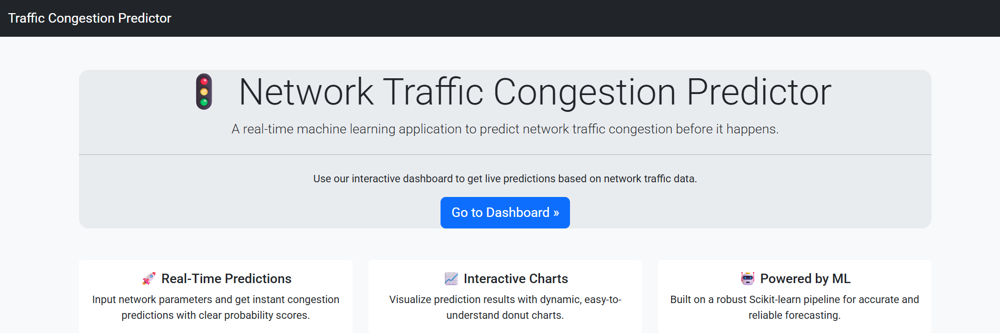
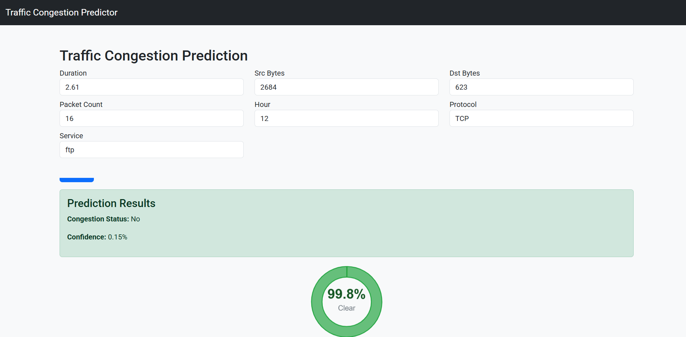

# Network Traffic Congestion Predictor 🚦

A machine learning application to predict network traffic congestion in real-time. Built with Python, Scikit-learn, and Flask, it features a complete ML pipeline from data generation to prediction via a REST API and an interactive web dashboard.




## ✨ Features

- **User-Friendly Interface**: A welcoming introduction page and an intuitive dashboard for live predictions.
- **One-Command Pipeline**: Run data generation, model training, and the web app with a single command (`python run.py`).
- **Interactive Dashboard**: Make live predictions and visualize results with a modern Bootstrap UI and a responsive donut chart (Chart.js).
- **REST API**: Predict congestion via a simple HTTP POST request.
- **Config-Driven Training**: All model and pipeline settings are managed in `core/config.yaml`.
- **Hyperparameter Tuning**: Automated model optimization with `GridSearchCV`.
- **Synthetic Data Generation**: Easily generate realistic network traffic data for experimentation.
- **Optional Email Alerts**: Get notified when high-probability congestion is detected (configurable via environment variables).
- **Unit Tests**: Includes a suite of tests for core logic and API endpoints.

## 📂 Project Structure

```
├── assets/
│   ├── datasets/       # Stores synthetic_network_data.csv
│   └── models/         # Stores the trained model pipeline (gb_model.pkl)
├── core/
│   ├── config.yaml     # Model & pipeline configuration
│   ├── predictor.py    # Loads the full pipeline and serves predictions
│   └── trainer.py      # The ML training pipeline logic
├── tests/                # Unit and integration tests
├── web/
│   ├── app.py          # Flask application (API and UI routes)
│   ├── email_service.py # Email alert logic
│   ├── static/         # CSS and JS files
│   └── templates/      # HTML templates
├── run.py                # Main script to run the pipeline and web app
├── train.py              # Script to execute model training (used by run.py)
├── generate_data.py      # Script for generating synthetic data (used by run.py)
└── requirements.txt
```

## 🚀 Quickstart

### 1. Prerequisites
- Python 3.9+

### 2. Setup & Run

```bash
# Create and activate a virtual environment
python -m venv .venv
source .venv/bin/activate  # On Windows: .venv\Scripts\activate

# Install dependencies
pip install -r requirements.txt

# Run the full pipeline (data generation, training, web app)
python run.py
```

The application will be available at [http://127.0.0.1:5000](http://127.0.0.1:5000), with the dashboard at the `/dashboard` route.

**Advanced:**  
You can run individual steps:
- `python run.py data` – Only generate data
- `python run.py train` – Only train the model
- `python run.py web` – Only start the web app

## 📊 Sample Input Data

The model expects network traffic data with the following fields:

```json
{
    "duration": 10.5,
    "src_bytes": 5120,
    "dst_bytes": 2400,
    "packet_count": 65,
    "hour": 9,
    "protocol": "TCP",
    "service": "http"
}
```

| Field         | Type    | Description                              | Valid Values         |
|---------------|---------|------------------------------------------|---------------------|
| duration      | float   | Connection duration in seconds           | > 0                 |
| src_bytes     | int     | Bytes sent from source                   | ≥ 0                 |
| dst_bytes     | int     | Bytes sent from destination              | ≥ 0                 |
| packet_count  | int     | Number of packets in connection          | > 0                 |
| hour          | int     | Hour of the day                          | 0–23                |
| protocol      | string  | Network protocol                         | TCP, UDP, ICMP      |
| service       | string  | Application service type                 | http, ftp, ssh, etc.|

## 🖥️ Usage

### Web Interface
- **Introduction Page**: Visit [http://127.0.0.1:5000](http://127.0.0.1:5000) for an overview of the application.
- **Dashboard**: Navigate to [http://127.0.0.1:5000/dashboard](http://127.0.0.1:5000/dashboard) to use the interactive form and see live prediction charts.

### API Endpoint
Send a POST request to `/api/predict`:

```bash
curl -X POST http://127.0.0.1:5000/api/predict \
     -H "Content-Type: application/json" \
     -d '{
          "duration": 10.5,
          "src_bytes": 5120,
          "dst_bytes": 2400,
          "packet_count": 65,
          "hour": 9,
          "protocol": "TCP",
          "service": "http"
     }'
```

**Sample Response:**
```json
{
  "congestion": true,
  "probability": 0.87
}
```

## ⚙️ Configuration

Edit `core/config.yaml` to adjust:
- Model hyperparameters (`model_params`)
- Feature selection (`feature_selection_k`)
- Hyperparameter search grid (`grid_search_params`)

## ✅ Testing

Run all tests with:
```bash
pytest
``` 